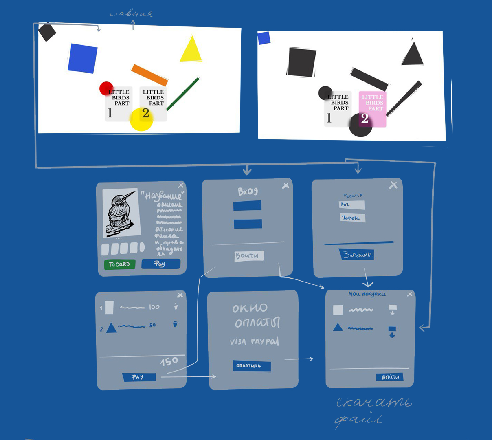
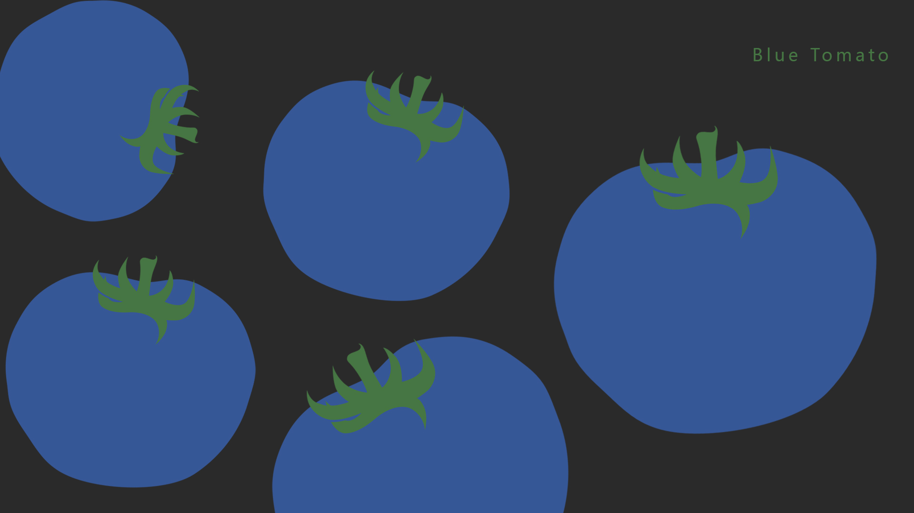

# Blue Tomato — магазин цифровых раскрасок

  


## О проекте

**Blue Tomato** — это прототип магазина цифровых раскрасок, созданный на React и TypeScript с использованием Redux Toolkit для управления состоянием.

## Идея

Это магазин цифровых раскрасок.
Откуда такая идея? Когда-то моя профессия была связана с рисованием, но сейчас это хобби. В основном я рисую контурные и графичные иллюстрации. Полгода назад мне пришла идея сделать книгу раскрасок про маленьких птиц для детей. Но не простую — а интересную: не просто контуры, а целый исследовательский журнал, где каждый ребёнок сможет почувствовать себя исследователем и первооткрывателем.
Я сверстала книгу и раздала весь небольшой тираж — идея детям очень понравилась. После этого мне захотелось её расширить.
Теперь раскраску можно будет купить как в цифровом, так и в печатном формате.


Проект создаёт витрину раскрасок, где каждая карточка иллюстрирует контурный арт, и при наведении на карточку весь фон переходит в чёрно-белый режим, чтобы акцентировать внимание на обложке. Это не просто декоративный эффект — это часть общего замысла.

## Стек

- React
- TypeScript
- Redux Toolkit
- CSS Modules
- Vite

## Компоненты

- `App` — корневой компонент
- `AppHeader` — хедер сайта
- `AppBackground` — динамический фон
- `ProductCard` — карточка раскраски
- Redux Slice: `hoverSlice` — управляет наведением для визуального эффекта

## Разработка

Чтобы запустить проект:

```bash
npm install
npm run dev
